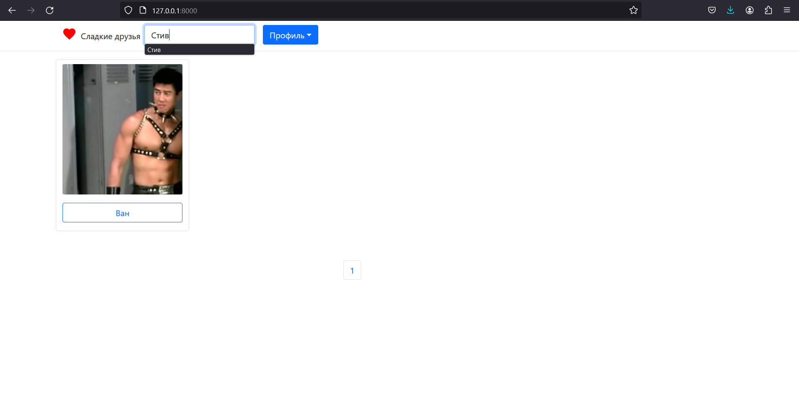
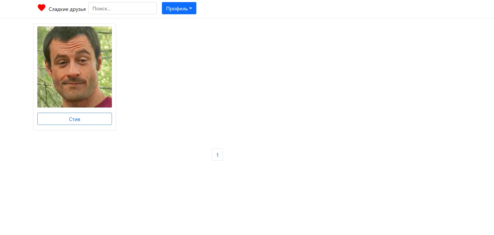

# Вас приветствует проект сервиса для социальной сети "Сладкие друзья".
#### Клонируйте проект к себе на компьютер *git clone https://github.com/MRPARFENTYEV/friends_service.git*
#### Создайте миграции *python manage.py makemigrations*
#### Примените миграции *python manage.py migrate*
#### Создайте суперпользователя *python manage.py createsuperuser*
#### Заходите в админку *http://127.0.0.1:8000/admin/*

## Что такое сервис "Сладкие друзья"?
#### "Сладкие друзья" это проект разработанный для компании ВК. По их заданию нужно было разработать такой сервис,
который был бы выполнен при помощи Django Rest Framework, позволял бы создать свою страничку, посмотреть страничку 
#### другого пользователя и добавить его в друзья, а также иметь возможность посмотреть друзей нового друга

## Как работать с сайтом?
#### После того как вы загрузили проект и запустили сервис через python manage.py runserver у вас появится страничка входа:
#### 
#### Затем можете зарегистрировать несколько своих друзей, не забудьте подгрузить фотографии.
#### Можете посмотреть возможных друзей:
#### 
#### Зайдите на страницу *http://127.0.0.1:8000/potential_friends/* и посмотрите на пользователей сайта:
#### 
#### Нажмите на понравившегося вам пользователя. Если он уже ваш друг, то вы можете удалить его из друзей, а если нет,то добавить.
#### 
#### Вы можете посмотреть сладких друзей пользователя, кликнуть по ним и подружиться
#### 
#### А также вы можете использовать поиск, чтобы найти Стива и не только:
#### 
#### А вот и Стив
#### 

#### Надеемся что сайт вам понравился и вы поддерживаете идеи по сближению людей на расстоянии
